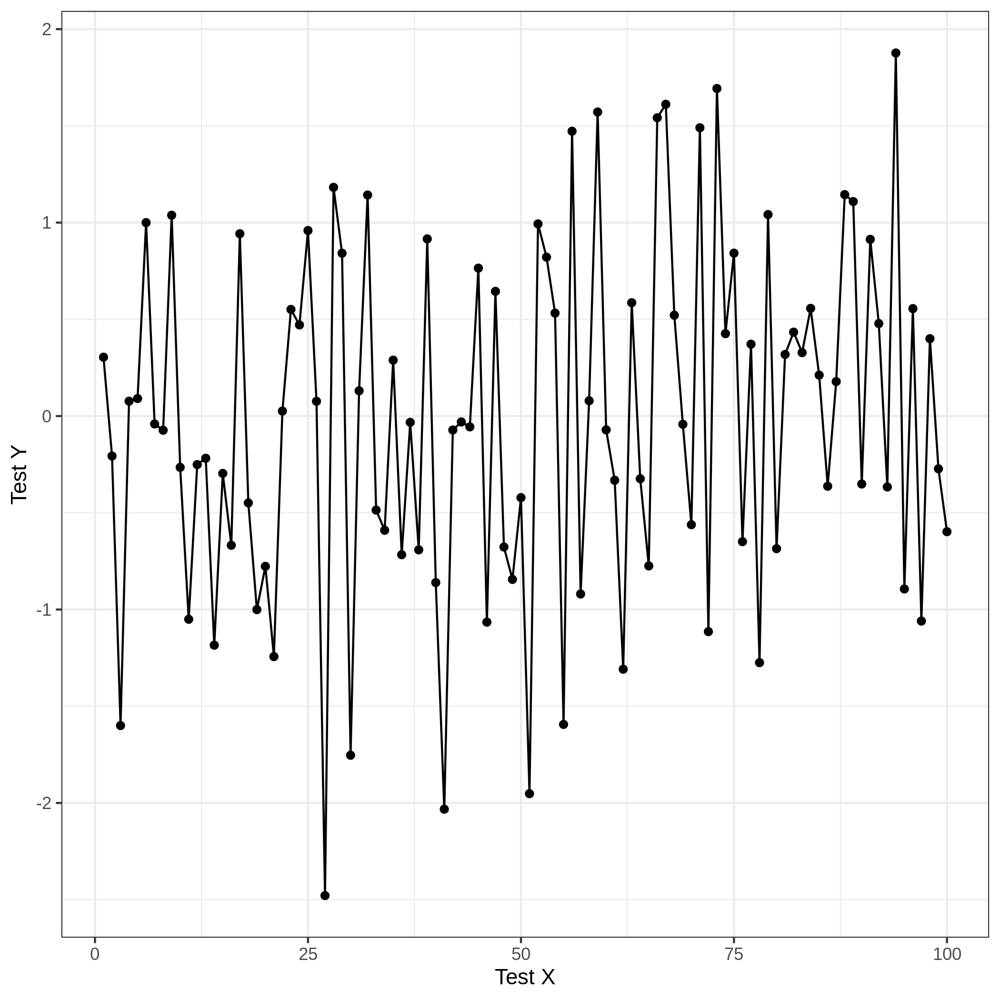

<!-- README.md is generated from README.Rmd. Please edit that file -->

```{r, include = FALSE}
knitr::opts_chunk$set(
  collapse = TRUE,
  comment = "#>"
)
```

# test-actions

<!-- badges: start -->
[](https://github.com/ericward-noaa/test-actions/actions)
<!-- badges: end -->

The goal of test-actions is to ...

```{r echo=FALSE}

```

